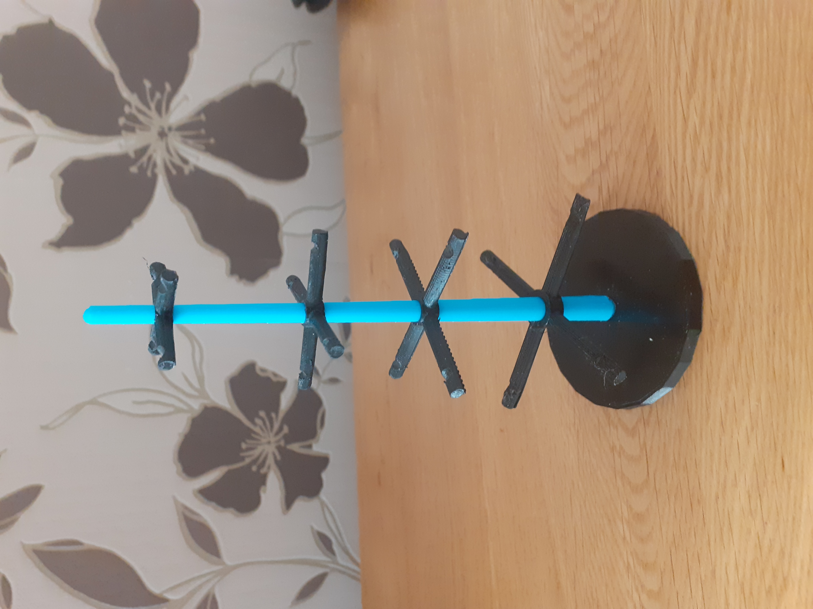

# NMC3DPrintClub

Useful files and guidance for the 3D Print Club at the [NeuroMuscular Centre](http://www.nmcentre.com/)

# Background 🛠️

Andy, Chris, Dennis, Jason, Kay, Paul and Ross have been experimenting with the NMC's Prusa i3 Mk3 3D Printer experimenting making [desktop logos](https://github.com/cheapjack/ThoughtsOnTheDesktop/blob/master/models/happySphereLidWithLogo.stl), straw holders for drinks, [phone holders](https://github.com/cheapjack/NMC3DPrintClub/blob/master/models/Dennis_Phone_Holder/iphone11_holder.stl) and wheelchair frame [blanking plates](https://github.com/cheapjack/NMC3DPrintClub/blob/master/models/blankingplate/blanking%20plate.stl).

Insipred by local makers like [DoESLiverpool](https://doesliverpool.com/) we started printing face visors to help people in the NMC community.

Have a look at Ross's [introduction to 3D printing](https://slides.com/cheapjack/ross-dalziel) from last year and browse all the source files below.

## Social Accounting

 

This club has had a really positive affect on all of us, especially during lockdown. Part of the club was thinking up an alternative way of visualising moods and feelings with 3D Printing; Chris designed a "Mood Tree" so you could hang little 3D printed (or other things) on it to represent your mood. You can view and download the files for printing [here](models/moodtree/MOODTREE.stl)

 
