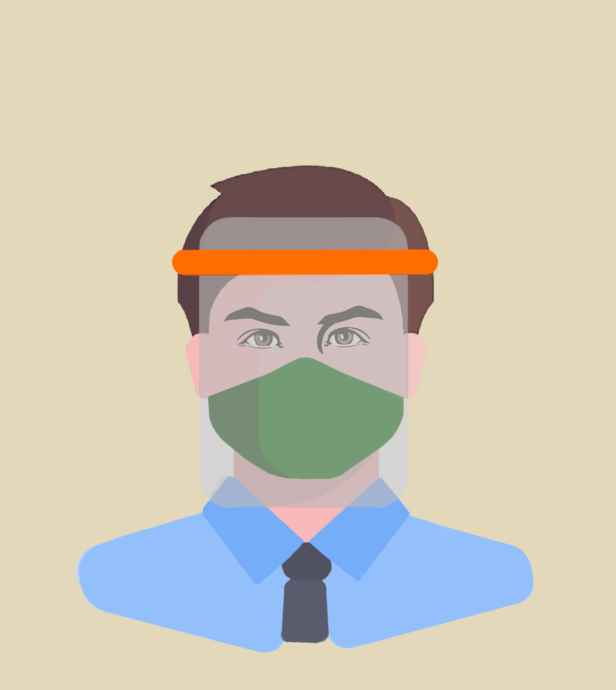

## FAQ 📋

### Will This Protect Myself & Others From Coronavirus? 😷

Only in a limited way. A face visor on it's own will not protect yourself or others against airbourne aerosols or droplets that may carry the coronavirus, it must be combined with an appropriate [FFP3/2 Face mask](https://www.3m.co.uk/3M/en_GB/company-uk/3m-products/~/3M-Disposable-Respirators-8300-Series/). These masks are difficult to make in makerspaces or with 3D printers. The visor design will only shield you and others from aerosols at certain directions and speeds, other particulates circulating in the air, for example in a bathroom with a hand dryer, can of course get behind the visor, like wise particulates from exhaling can get around the visor, without the appropriate mask. 

In summary it does provide *some* protection, but only in a *limited* way which we describe here. It is only one part of the required PPE and is not recommended or endorsed by the NHS in any 'official' capacity.

You must always take care removing the visor that you dont spread particulates that might be on the inside or outside of the clear plastic. You must take care changing the clear PVC sheet: we advise wiping with warm soapy water first, then removing and then cleaning the frame.

Please ensure read the [Visor Packing Note](https://github.com/cheapjack/NMC3DPrintClub/blob/master/covid19/Visor_Packing_Slip.md) provided before using.

### Can I Use It More Than Once? 🤔 

Ideally they are single use only because we cannot confirm they can be made 100% sterile. However they *can* be carefully cleaned to a reasonable low risk, with hot soapy water or 99% alcohol handwash as detailed in the diagrams above (not 100% to ensure the alcohol can penetrate the virus lipid surface). Again this is at the users OWN RISK. We advise to only have a **SINGLE USER OF ANY VISOR** and **CLEAN** and **REPLACE** the acetate sheet regularly.

Ensure the components dry fully. Consider 2 visors to interchange if you are going to use it often.

### Is This Official NHS PPE? 😷

Not the designs we suggest. We must acknowledge that these visors are not 'official' NHS England approved, but a best fit contingency in the context of a supply crisis.

### What are We Doing? 🔧

We are experimenting with how 3D printing can help our community. We must be completely clear on the limited nature of the protection this design may provide. If it only makes us aware of the dangers of contagion, how we behave, who and what we are in contact with, how many times we touch our faces, then that is useful but we should be careful how we present whatever we do.

Please consult our [Visor Packing Note](https://github.com/cheapjack/NMC3DPrintClub/blob/master/covid19/Visor_Packing_Slip.md) to explain the limits of use further.

### How Do We Talk About This? 🗣️

It's an exciting story to say we are helping out in the crisis, but it's important to always give as much context for what we are doing as possible and not let important details get left out, especially the conditions that we are making them in, the conditions of use that might make them effective, who might use them (people at NMC and the 3D print club only initially) and the limited impact, if we are honest, we might make to the general supply crisis related to the pandemic. That is a structural problem in society that really should not have to be 'fixed' or outsourced by amateur makers but more effectively by a public owned NHS.

Be clear that we are not supplying the NHS, or replacing 'official' equipment but are experimenting with designs from the Maker community to make **3D Printed Protective Face Visors**. It's important to not call them masks, as this refers to the FFP3/2 or N95 rated breathing masks that most effectively filter droplets and particulates that might harbour the virus. It's important not to overstate the protection that may or may not be provided by their use. They must be used with appropriate breathing masks, hygeine and social distancing practices to be fully effective.

### Do These Designs Help the NHS? 😷

 We can probably best help the NHS following the government guidelines for the present lockdown situation. Also use your own common sense and protect other humans. These visors though are something we can experiment with for ourselves if we need to visit the NMC or work there or shop near others and potentially use post-lockdown in the absence of more appropriate PPE. If we can help the critical demand for PPE by not adding more to it, it's helpful but we must understand this is not a simple story of 3D printers saving lives. We are not doing that. People like DoESLiverpool have had a community working at it, but even then it is not to replace conventionally manufactured PPE visors but to help in an emergency.

### Are we Selling PPE? 🤔

No, to be clear they are not for sale, but available with an expected donation to cover material costs and support the NMC.

### How Can I help? ✊

Best help would be to social distance and shield as much as you can under NHS advice and take care of the others around you where possible. Also keep in touch with other members of the NMC community and the [NMC Website](http://www.nmcentre.com/)

You can browse all the source files of the prints and more extensive info in the [project repository](https://github.com/cheapjack/NMC3DPrintClub)

