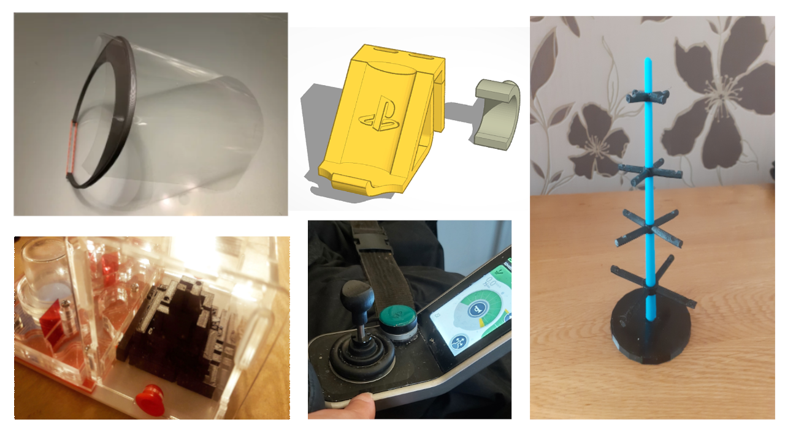

# 3D Print Club Meetup ⛺🗜️🖨️
## Tuesday 3rd August 2021 11am - 3pm
### The NMC Marquee Tent, at the NeuroMuscular Centre garden, Woodford Lane West, Winsford, CW7 4EH

Come and see the NMC 3D Print Club and meet the team to see some of the projects we've been working on over lockdown and find out how to get involved.

### Arrival & Staying Safe 😷

Make your way to the main entrance of the NMC where someone will take your temperature & check you in before directing you to the event tent.

Please make sure you've completed a lateral flow test within 24 hours before attending and record the result on the NHS website or app and present your confirmation email or text on check in - thanks!!

### Lunch 🥪

Please bring your own lunch if you need to. There are snacks and drinks available to buy in the tent however.
