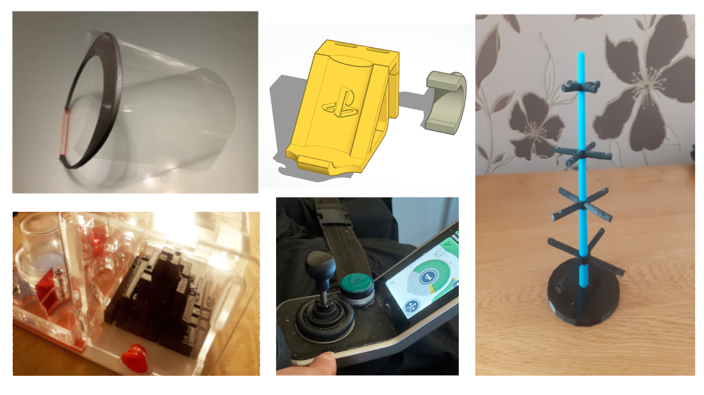

# 3D Print Club FAQ's ⛺🗜️🖨️

## FAQ's

 * Print Area

The Maximum Print Area is 250 x 210 x 210 mm. In pratice making something even close to that size would take 40 hours plus to print so breaking down your project into components and considering mixing with other materials.

 * Print Time

 * Materials
   * PLA
   * ABS
   * Alternative Materials

 * Printers 

We have 2 [Prusa i3 MK3S Printer](https://www.prusa3d.com/category/original-prusa-i3-mk3s/)
