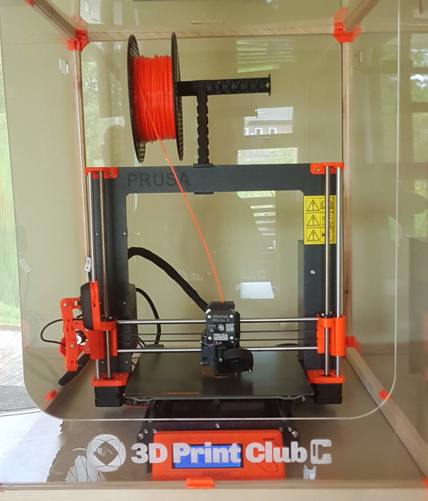

News, files and guidance for the 3D Print Club at the [NeuroMuscular Centre](http://www.nmcentre.com/)

# Welcome To 3D Print Club! 

The 3D Print club is a friendly space for designing and making 3D objects. You don't need to be an expert or a designer, we'll guide you. 

## Ideas 💭
If you're just beginning in 3D printing we often get prople to have a look at [Thingiverse](https://thingiverse.com/) the place where the 3D print community share their designs for free. Get inspired then get in touch at <a href="mailto:Hello3DPrintClub@nmcentre.com?Subject=Hello%20Printers">Hello3DPrintClub@nmcentre.com</a>

# Background 🛠️

Andy, Chris, Dennis, Jason, Kay, Paul and Ross have been experimenting with the NMC's Prusa i3 Mk3 3D Printer making [desktop logos](https://github.com/cheapjack/ThoughtsOnTheDesktop/blob/master/models/happySphereLidWithLogo.stl), straw holders for drinks, [phone holders](https://github.com/cheapjack/NMC3DPrintClub/blob/master/models/Dennis_Phone_Holder/iphone11_holder.stl) and wheelchair frame [blanking plates](https://github.com/cheapjack/NMC3DPrintClub/blob/master/models/blankingplate/blanking%20plate.stl).

Insipred by local makers like [DoESLiverpool](https://doesliverpool.com/) we started printing face visors to help people in the NMC community.

Have a look at Ross's [introduction to 3D printing](https://slides.com/cheapjack/ross-dalziel) from last year and browse all the source files of the prints and more extensive info in our [project repository](https://github.com/cheapjack/NMC3DPrintClub)

## Get involved

Keep checking for updates here, and if you'd like to get involved please [email Kay Briggs at the NMC here](mailto:kay.briggs@nmcentre.com)

# Projects

## The Future

Check out our wishlist and plans for [the future here](FutureNotes.md)

## Social Accounting 📁🌲

This club has had a really positive affect on all of us, especially during lockdown. Part of the club was thinking up an alternative way of visualising moods and feelings with 3D Printing; Chris designed a "Mood Tree" so you could hang little 3D printed (or other things) on it to represent your mood. You can view and download the files for printing [here](https://github.com/cheapjack/NMC3DPrintClub/tree/master/models/moodtree)

## Interspecies Gaming 🦟🎮

For a while now we've been working on 3D printed environments presented as educational 'kits' to play with fruit flies, the '[model organism](https://en.wikipedia.org/wiki/Model_organism)' *Drosophila melanogasta*. This organism is used in genetics and the study of - amongst many other things - neuromuscular conditions like Muscular Dystrophy that affect many of us in the group.

Our original idea was to imagine and design  environments for Fruit flies that 'had' i.e. expressed the muscular condition that leads to Muscular Dystrophy, could live in. Doing this was a way of thinking about our own genetic conditions and how biomedical science studies those conditions. Rather than using flies that actually have muscular dystrophy, we used flies that were already bred and supplied on eBay to be flightless, usually used for people who have aquariums and other pet environments to make 'natural' ecosystems for fish and reptiles. These flies have underdeveloped wings that means they dont fly, a parallel to our own limitations.

We are designing 3D printed landscapes and mazes to fit an existing ant farm kit on eBay - see the image above - which lets you safely feed and take care of these flys. Eventually we want the kit to help people understand biomedical science and reflect on our own conditions and environments - and how we care for each other both in and out of lockdown.

You can browse all the source files of the prints and more extensive info in the [project repository](https://github.com/cheapjack/NMC3DPrintClub)
