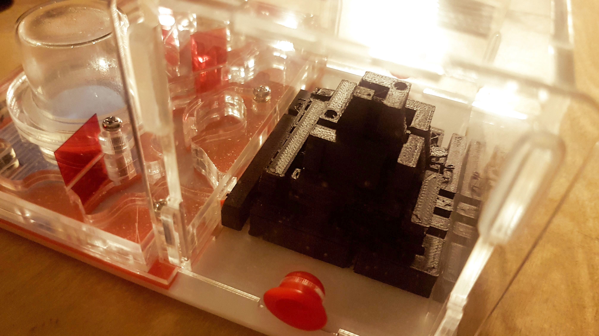
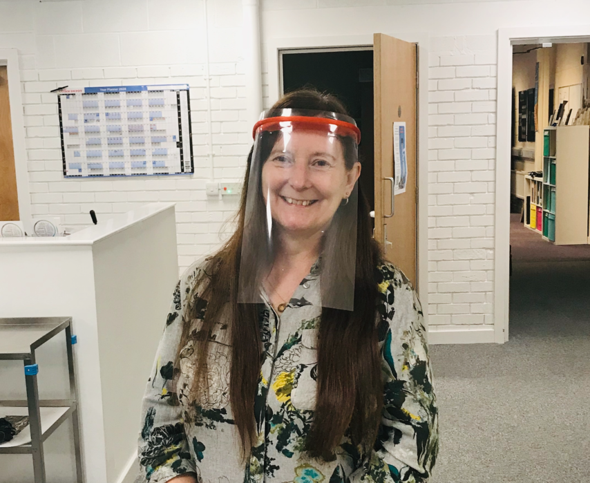

News, files and guidance for the 3D Print Club at the [NeuroMuscular Centre](http://www.nmcentre.com/)

# Background 🛠️

Andy, Chris, Dennis, Jason, Kay, Paul and Ross have been experimenting with the NMC's Prusa i3 Mk3 3D Printer experimenting making [desktop logos](https://github.com/cheapjack/ThoughtsOnTheDesktop/blob/master/models/happySphereLidWithLogo.stl), straw holders for drinks, [phone holders](https://github.com/cheapjack/NMC3DPrintClub/blob/master/models/Dennis_Phone_Holder/iphone11_holder.stl) and wheelchair frame [blanking plates](https://github.com/cheapjack/NMC3DPrintClub/blob/master/models/blankingplate/blanking%20plate.stl).

Insipred by local makers like [DoESLiverpool](https://doesliverpool.com/) we started printing face visors to help people in the NMC community.

Have a look at Ross's [introduction to 3D printing](https://slides.com/cheapjack/ross-dalziel) from last year and browse all the source files of the prints and more extensive info in our [project repository](https://github.com/cheapjack/NMC3DPrintClub)

# Social Accounting 📁🌲

This club has had a really positive affect on all of us, especially during lockdown. Part of the club was thinking up an alternative way of visualising moods and feelings with 3D Printing; Chris designed a "Mood Tree" so you could hang little 3D printed (or other things) on it to represent your mood. You can view and download the files for printing [here](https://github.com/cheapjack/NMC3DPrintClub/tree/master/models/moodtree)

# Interspecies Gaming 🦟🎮

For a while now we've been working on 3D printed environments presented as educational 'kits' to play with fruit flies, the '[model organism](https://en.wikipedia.org/wiki/Model_organism)' *Drosophila melanogasta*. This organism is used in genetics and the study of - amongst many other things - neuromuscular conditions like Muscular Dystrophy that affect many of us in the group.

Our original idea was to imagine and design  environments for Fruit flies that 'had' i.e. expressed the muscular condition that leads to Muscular Dystrophy, could live in. Doing this was a way of thinking about our own genetic conditions and how biomedical science studies those conditions. Rather than using flies that actually have muscular dystrophy, we used flies that were already bred and supplied on eBay to be flightless, usually used for people who have aquariums and other pet environments to make 'natural' ecosystems for fish and reptiles. These flies have underdeveloped wings that means they dont fly, a parallel to our own limitations.

We are designing 3D printed landscapes and mazes to fit an existing ant farm kit on eBay - see the image above - which lets you safely feed and take care of these flys. Eventually we want the kit to help people understand biomedical science and reflect on our own conditions and environments - and how we care for each other both in and out of lockdown.

# PPE 😷

The NMC 3D Print Club have been monitoring the national (& international) 'maker' community response to the PPE supply crisis relating to the COVID-19 pandemic and have followed closely the designs of protective face visors that [DoESLiverpool](https://doesliverpool.com) have been using for their [PPE Manufacturing effort](https://ppe.doesliverpool.com/).

Early on in the crisis we were passed on a design for a protective face visor that although well intentioned was not fit for purpose.

We wanted to contribute and make our own visors, for use in the NMC day to day, so initially we looked at the designs that DoES were making, their community having already gone through lengthy design conversations and decisions, prototypes, wrong turns, success and failure, accommodated a range of issues and problems, before settling on a design they could feasibly and efficiently and safely make.

Their community represents a huge body of amateur and professional knowledge including the persepectives of NHS staff who, although there is no official endorsement from NHS England, have vouched for its usefulness. We think 're-inventing the wheel' ie using a new design will not help anyone, as well meaning as this may be.

So we made a donation to the [DoESLiverpool PPE Manufacturing Project](https://ppe.doesliverpool.com/) and they have provided us with 25 of their face visors which staff are going to use in a deep clean and preperation of the centre for limited re-opening.

## Print Our Own 🖨️

We are starting to print and test a design by [Maker Mike Lauderdale's Design](https://www.thingiverse.com/thing:4253904/) and we'll be making them available in the NMC or on request but would like a small donation to cover costs.

We are also providing a [Surgical Mask Strap Support](#surgical-mask-strap)

This helps cover material costs and any profit will go to supporting the NMC.

Item|Donation
---|---
3D Printed Face Visor Kit, with Frame & 2 acetate sheets|£5
Extra clean transparent visor acetate sheet|£1
3D Printed Surgical Mask Strap|£1

## How Do I Get a Visor? 🤔

Please contact **[kay.briggs@nmcentre.com](mailto:kay.briggs@nmcentre.com)** to order one and send your donation to our [Just Giving Page](https://uk.virginmoneygiving.com/charity-web/charity/finalCharityHomepage.action?charityId=1003016)

Please note that this is a volunteer project and we are making each kit to order so please be patient and we will do our best to get your kit to you within a week.

## What You Get in Your Visor kit 📦

 1. 3D Printed Visor made from [PETG](https://prusament.com/media/2020/01/PETG_TechSheet_ENG.pdf)
 1. 180 Micron A4 Acetate sheet from [Ebay](https://www.ebay.co.uk/itm/25-x-A4-Transparent-Acetate-180-Micron-Clear-PVC-Sheets/353057356757)
 1. Elastic (For you to cut to size and comfort, an elastic band can work just aswell)

### How to Assemble & Use 🔧

See the images below to assemble and use your Face Visor. PLEASE NOTE We cannot confirm they can be made 100% sterile. However they can be carefully cleaned with hot soapy water or 99% alcohol handwash as detailed below (not 100% to ensure the alcohol can penetrate the virus lipid surface). RE-USE is at the users OWN RISK. We advise to only have a SINGLE USER OF ANY VISOR and REPLACE the acetate sheet regularly.

You can also place the acetate sheet in a 'landscape' orientation which some users have recommended.  

### Design We Use 📋

We reviewed this [comprehensive list and notes](https://github.com/DoESLiverpool/covid19/blob/master/FaceShield.md) before settling on using [Maker Mike Lauderdale's Design](https://www.thingiverse.com/thing:4253904/) because it's really easy to print and assemble without needing any additional equipment. It fits a standard elastic band and A4 180 micron thick Acetate sheets. We've printed a few and they work really well and are surprisingly comfortable.

### Surgical Mask Strap 😷

Kay has a [design for a Surgical Mask Strap Support](https://www.thingiverse.com/thing:4202906) that supports long term face mask use.

Wearing and removing a face mask can be tricky, you can effectively spray droplets and contaminate yourself and others with the mask contents if worn carelessly and this looks like it might help keep it securely and comfortably in position.

## Supporting Others 👋

There are many ways to support each other in a crisis with or without 3D printing as many of us at the NMC continue to do, so keep in touch with all the NMC news and your friends remember all the hard work they are still doing.

You can still support the [DoES PPE Project here](https://www.gofundme.com/f/get-visors-into-the-hands-of-healthcare-workers) but as PPE supply is now more or less getting to the people who need it most, demand has now slowed down. There are other aid groups out there of course like [Acorn renters union](https://acorntheunion.org.uk/corona/) or [West Cheshire Community Response](https://winsford.gov.uk/3706-2/)

## Preperations ⚠️

Kay Briggs has setup our 3D printer at a clean workspace at home so she's now our official 3D Printing hub!

We'll make sure we make and pack the printed visors as safely as possible and then keep for at least 3 days before delivering to the pickup point.

## FAQ 📋

### Will This Protect Myself & Others From Coronavirus? 😷

Only in a limited way. A face visor on it's own will not protect yourself or others against airbourne aerosols or droplets that may carry the coronavirus, it must be combined with an appropriate [FFP3/2 Face mask](https://www.3m.co.uk/3M/en_GB/company-uk/3m-products/~/3M-Disposable-Respirators-8300-Series/). These masks are difficult to make in makerspaces or with 3D printers. The visor design will only shield you and others from aerosols at certain directions and speeds, other particulates circulating in the air, for example in a bathroom with a hand dryer, can of course get behind the visor, like wise particulates from exhaling can get around the visor, without the appropriate mask.

In summary it does provide *some* protection, but only in a *limited* way which we describe here. It is only one part of the required PPE and is not recommended or endorsed by the NHS in any 'official' capacity.

You must always take care removing the visor that you dont spread particulates that might be on the inside or outside of the clear plastic. You must take care changing the clear PVC sheet: we advise wiping with warm soapy water first, then removing and then cleaning the frame.

Please ensure read the [Visor Packing Note](https://github.com/cheapjack/NMC3DPrintClub/blob/master/covid19/Visor_Packing_Slip.md) provided before using.

### Can I Use It More Than Once? 🤔

Ideally they are single use only because we cannot confirm they can be made 100% sterile. However they *can* be carefully cleaned to a reasonable low risk, with hot soapy water or 99% alcohol handwash as detailed in the diagrams above (not 100% to ensure the alcohol can penetrate the virus lipid surface). Again this is at the users OWN RISK. We advise to only have a **SINGLE USER OF ANY VISOR** and **CLEAN** and **REPLACE** the acetate sheet regularly.

Ensure the components dry fully. Consider 2 visors to interchange if you are going to use it often.

### Is This Official NHS PPE? 😷

Not the designs we suggest. We must acknowledge that these visors are not 'official' NHS England approved, but a best fit contingency in the context of a supply crisis.

### What are We Doing? 🔧

We are experimenting with how 3D printing can help our community. We must be completely clear on the limited nature of the protection this design may provide. If it only makes us aware of the dangers of contagion, how we behave, who and what we are in contact with, how many times we touch our faces, then that is useful but we should be careful how we present whatever we do.

Please consult our [Visor Packing Note](https://github.com/cheapjack/NMC3DPrintClub/blob/master/covid19/Visor_Packing_Slip.md) to explain the limits of use further.

### How Do We Talk About This? 🗣️

It's an exciting story to say we are helping out in the crisis, but it's important to always give as much context for what we are doing as possible and not let important details get left out, especially the conditions that we are making them in, the conditions of use that might make them effective, who might use them (people at NMC and the 3D print club only initially) and the limited impact, if we are honest, we might make to the general supply crisis related to the pandemic. That is a structural problem in society that really should not have to be 'fixed' or outsourced by amateur makers but more effectively by a public owned NHS.

Be clear that we are not supplying the NHS, or replacing 'official' equipment but are experimenting with designs from the Maker community to make **3D Printed Protective Face Visors**. It's important to not call them masks, as this refers to the FFP3/2 or N95 rated breathing masks that most effectively filter droplets and particulates that might harbour the virus. It's important not to overstate the protection that may or may not be provided by their use. They must be used with appropriate breathing masks, hygeine and social distancing practices to be fully effective.

### Do These Designs Help the NHS? 😷

 We can probably best help the NHS following the government guidelines for the present lockdown situation. Also use your own common sense and protect other humans. These visors though are something we can experiment with for ourselves if we need to visit the NMC or work there or shop near others and potentially use post-lockdown in the absence of more appropriate PPE. If we can help the critical demand for PPE by not adding more to it, it's helpful but we must understand this is not a simple story of 3D printers saving lives. We are not doing that. People like DoESLiverpool have had a community working at it, but even then it is not to replace conventionally manufactured PPE visors but to help in an emergency.

### Are we Selling PPE? 🤔

No, to be clear they are not for sale, but available with an expected donation to cover material costs and support the NMC.

### How Can I help? ✊

Best help would be to social distance and shield as much as you can under NHS advice and take care of the others around you where possible. Also keep in touch with other members of the NMC community and the [NMC Website](http://www.nmcentre.com/)

You can browse all the source files of the prints and more extensive info in the [project repository](https://github.com/cheapjack/NMC3DPrintClub)
