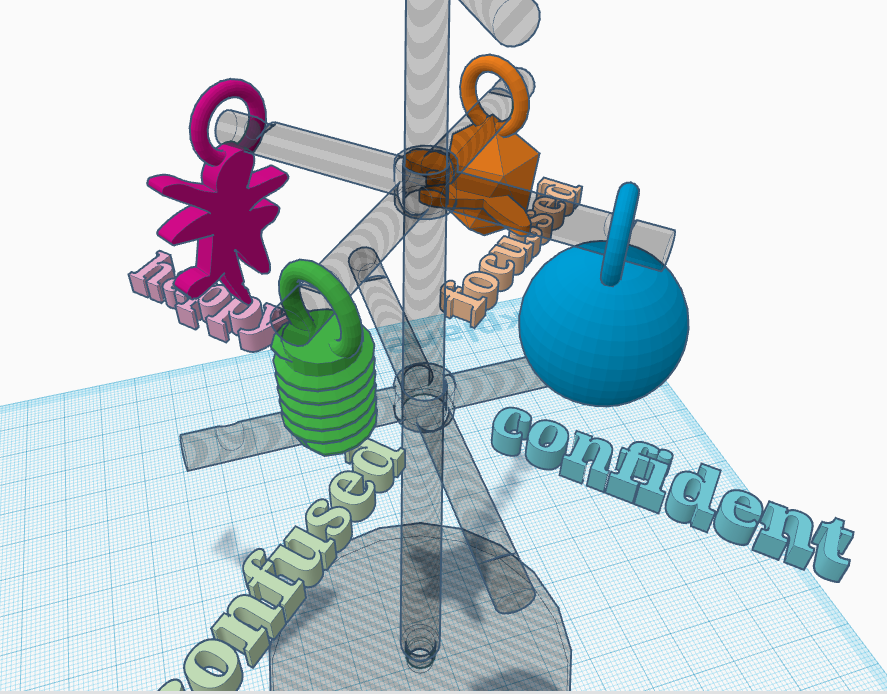
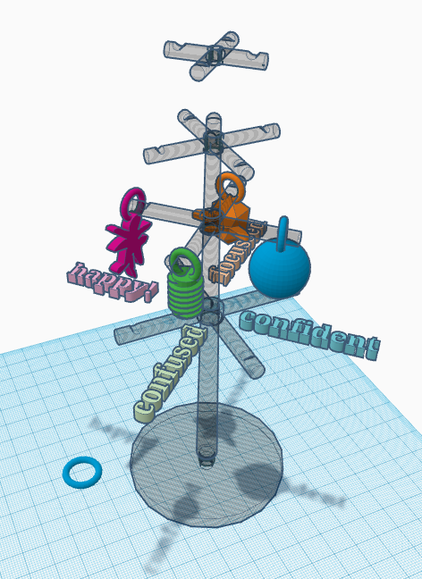
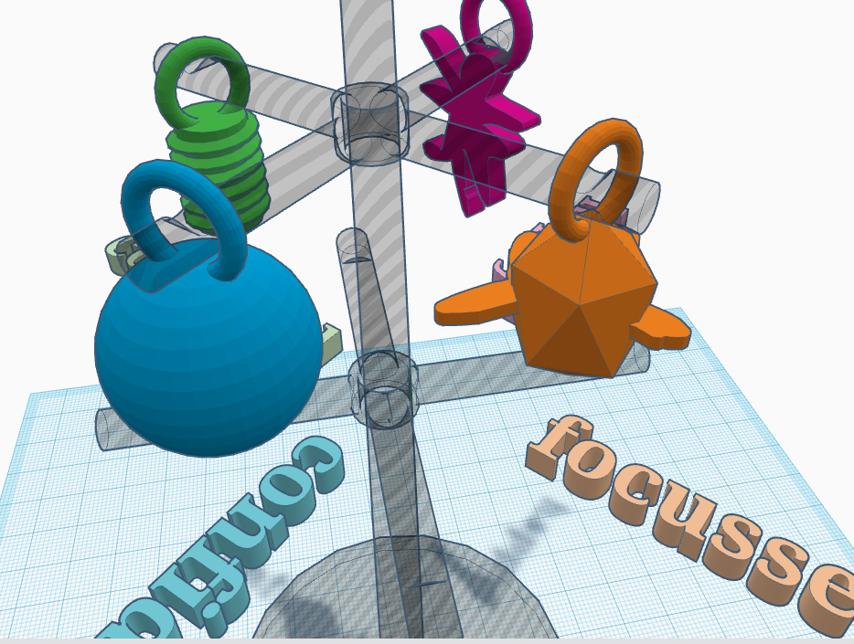

## Mood Tree

 

This club has had a really positive affect on all of us, especially during lockdown. 

Part of the club was thinking up an alternative way of visualising moods and feelings with 3D Printing; Chris designed a "Mood Tree" so you could hang little 3D printed (or other things) on it to represent your mood. You can view and download the files for printing [here](https://github.com/cheapjack/NMC3DPrintClub/tree/master/models/moodtree)

 

We've added some example shapes to represent moods and feelings and a torus to use as a hook for hanging 'moods' on the tree

 
 
