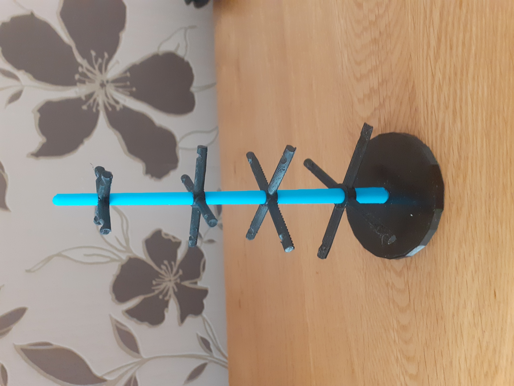

## Mood Tree

 

This club has had a really positive affect on all of us, especially during lockdown. 

Part of the club was thinking up an alternative way of visualising moods and feelings with 3D Printing; Chris designed a "Mood Tree" so you could hang little 3D printed (or other things) on it to represent your mood. You can view and download the files for printing [here](https://github.com/cheapjack/NMC3DPrintClub/tree/master/models/moodtree)

 

We've added some shapes to represent some of the moods and feelings we've been having over our journey from 3D Printing novices to Ender-hacking-PPE-manufacturing-3D-printing experts using software like [TinkerCAD](tinkercad.com/) and [OpenSCAD](http://www.openscad.org/), [BlocksCAD](https://www.blockscad3d.com/editor/) and the ever useful [Thingiverse](https://www.thingiverse.com/). 

Also we've included a torus shape you can merge with your own moods (make your shapes volume about 25 cubic mm) to use as a hook for hanging on the tree.

### Focussed

 

### Confident

 

### Confused

 

### Happy

 

 

